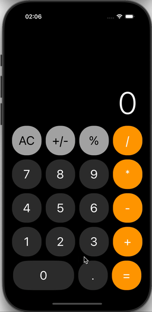

# CalculatorIOS

Приложение калькулятора на SwiftUI для iPhone.

## Описание

Это простое приложение калькулятора, реализованное с использованием SwiftUI и архитектурного паттерна MVVM. Оно поддерживает базовые арифметические операции: сложение, вычитание, умножение и деление. 

## Основные возможности

- Поддержка операций: +, -, *, /
- Изменение знака числа (+/-)
- Процент (%)
- Очистка (AC)

## Демонстрация

